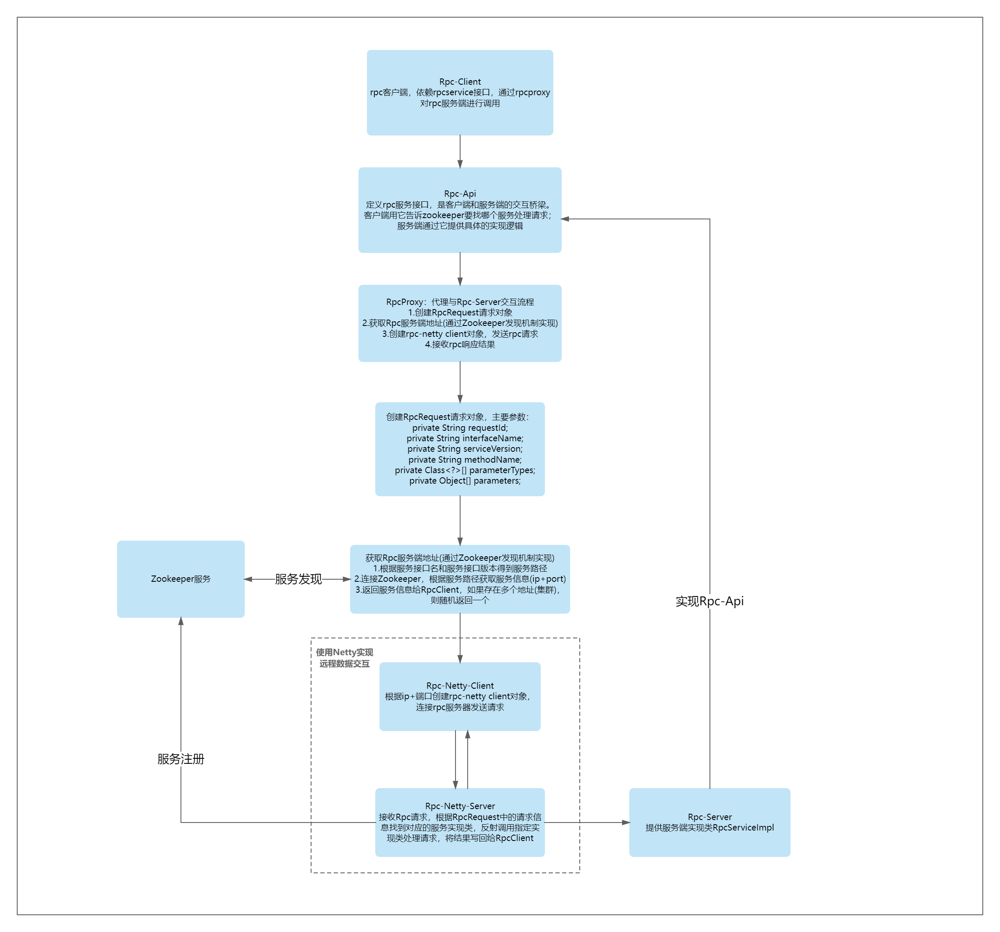

# 分布式 RPC 框架 - 使用说明

当前版本：1.3.0

发布日期：20151206

发布日志参见 `RELEASE.md` 文档

## 定义 RPC 接口

> 参见 rpc-sample-api 模块

```java
package com.xxx.rpc.sample.api;

public interface HelloService {

    String hello(String name);
}
```

需要将 RPC 接口与 RPC 实现分别存放在不同的模块中

## 发布 RPC 服务

> 参见 rpc-sample-server 模块

### 第一步：添加 Maven 依赖

#### pom.xml

```xml
<!-- RPC Sample API -->
<dependency>
    <groupId>com.xxx.rpc</groupId>
    <artifactId>rpc-sample-api</artifactId>
    <version>${version.rpc}</version>
</dependency>

<!-- RPC Server -->
<dependency>
    <groupId>com.xxx.rpc</groupId>
    <artifactId>rpc-server</artifactId>
    <version>${version.rpc}</version>
</dependency>
```

- RPC Sample API：RPC 接口所在模块的依赖
- RPC Server：RPC 服务端框架的依赖


### 第二步：实现 RPC 接口

```java
package com.xxx.rpc.sample.server;

import com.xxx.rpc.sample.api.HelloService;
import com.xxx.rpc.server.RpcService;

@RpcService(HelloService.class)
public class HelloServiceImpl implements HelloService {

    @Override
    public String hello(String name) {
        return "Hello! " + name;
    }
}
```

- 必须在 RpcService 注解中指定 RPC 接口
- 若 RPC 接口拥有多个实现类，则需要在 RpcService 注解中指定 version 属性加以区分

### 第三步：配置 RPC 服务端

#### spring.xml

```xml
<?xml version="1.0" encoding="UTF-8"?>
<beans xmlns="http://www.springframework.org/schema/beans"
       xmlns:xsi="http://www.w3.org/2001/XMLSchema-instance"
       xmlns:context="http://www.springframework.org/schema/context"
       xsi:schemaLocation="http://www.springframework.org/schema/beans
       http://www.springframework.org/schema/beans/spring-beans.xsd
       http://www.springframework.org/schema/context
       http://www.springframework.org/schema/context/spring-context.xsd">

    <context:component-scan base-package="com.xxx.rpc.sample.server"/>

    <context:property-placeholder location="classpath:rpc.properties"/>

    <!-- Service Registry -->
    <bean id="serviceRegistry" class="com.xxx.rpc.registry.zookeeper.ZooKeeperServiceRegistry">
        <constructor-arg name="zkAddress" value="${rpc.registry_address}"/>
    </bean>

    <!-- RPC Server -->
    <bean id="rpcServer" class="com.xxx.rpc.server.RpcServer">
        <constructor-arg name="serviceAddress" value="${rpc.service_address}"/>
        <constructor-arg name="serviceRegistry" ref="serviceRegistry"/>
    </bean>

</beans>
```

- Service Registry：用于服务注册，若使用 ZooKeeper 实现，则需提供 ZooKeeper 地址、系统名、实例号
- RPC Server：用于发布 RPC 服务，需要提供服务器端口

注册到 ZooKeeper 中的 ZNode 路径为：`registry/service/address`，前 2 个节点是持久的，最后 1 个节点是临时的

#### rpc.properties

```properties
rpc.service_address=127.0.0.1:8000
rpc.registry_address=127.0.0.1:2181
```

- rpc.service_address：发布 RPC 服务的地址
- rpc.registry_address：ZooKeeper 服务器的地址

### 第四步：启动 RPC 服务

```java
package com.xxx.rpc.sample.server;

import org.springframework.context.support.ClassPathXmlApplicationContext;

public class RpcBootstrap {

    public static void main(String[] args) {
        new ClassPathXmlApplicationContext("spring.xml");
    }
}
```

运行 RpcBootstrap 类，将对外发布 RPC 服务，同时进行服务注册

## 调用 RPC 服务

> 参见 rpc-sample-client 模块

### 第一步：添加 Maven 依赖

```xml
<!-- RPC Sample API -->
<dependency>
    <groupId>com.xxx.rpc</groupId>
    <artifactId>rpc-sample-api</artifactId>
    <version>${version.rpc}</version>
</dependency>

<!-- RPC Client -->
<dependency>
    <groupId>com.xxx.rpc</groupId>
    <artifactId>rpc-client</artifactId>
    <version>${version.rpc}</version>
</dependency>
```

- RPC Sample API：RPC 接口所在模块的依赖
- RPC Client：RPC 客户端框架的依赖

### 第二步：配置 RPC 客户端

#### spring.xml

```xml
<?xml version="1.0" encoding="UTF-8"?>
<beans xmlns="http://www.springframework.org/schema/beans"
       xmlns:xsi="http://www.w3.org/2001/XMLSchema-instance"
       xmlns:context="http://www.springframework.org/schema/context"
       xsi:schemaLocation="http://www.springframework.org/schema/beans
       http://www.springframework.org/schema/beans/spring-beans.xsd
       http://www.springframework.org/schema/context
       http://www.springframework.org/schema/context/spring-context.xsd">

    <context:property-placeholder location="classpath:rpc.properties"/>

    <!-- Service Discovery -->
    <bean id="serviceDiscovery" class="com.xxx.rpc.registry.zookeeper.ZooKeeperServiceDiscovery">
        <constructor-arg name="zkAddress" value="${rpc.registry_address}"/>
    </bean>

    <!-- RPC Proxy -->
    <bean id="rpcProxy" class="com.xxx.rpc.client.RpcProxy">
        <constructor-arg name="serviceDiscovery" ref="serviceDiscovery"/>
    </bean>

</beans>
```

- Service Discovery：用于服务发现，若使用 ZooKeeper 实现，则需提供 ZooKeeper 地址
- RPC Proxy：用于获取 RPC 代理接口

#### rpc.properties

```properties
rpc.registry_address=127.0.0.1:2181
```

- rpc.registry_address：ZooKeeper 服务器的地址（IP 地址与端口）

### 第三步：调用 RPC 服务

```java
@Autowired
private RpcProxy rpcProxy; // 1

...

HelloService helloService = rpcProxy.create(HelloService.class); // 2
String result = helloService.hello("World"); // 3
```

1. 注入 RpcProxy 对象
2. 调用 RpcProxy 对象的 create 方法来创建 RPC 代理接口
3. 调用 RPC 代理接口的方法，就像调用远程接口方法一样

###附录
0.参考项目：
    (1)[轻量级分布式 RPC 框架](https://gitee.com/huangyong/rpc)
    (2)[一个轻量级分布式RPC框架--NettyRpc](https://github.com/luxiaoxun/NettyRpc)
1.参考文档
    (1)[轻量级分布式 RPC 框架](https://my.oschina.net/huangyong/blog/361751)
    (2)[一个轻量级分布式RPC框架--NettyRpc](https://www.cnblogs.com/luxiaoxun/p/5272384.html)
2.模块功能解析图 
3.客户端、服务端、注册中心三者关系 
4.整体处理流程 